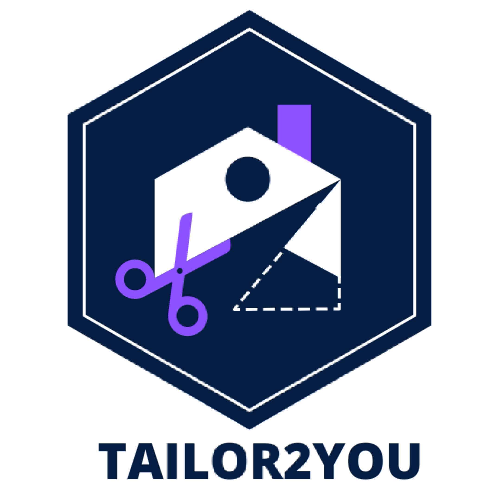
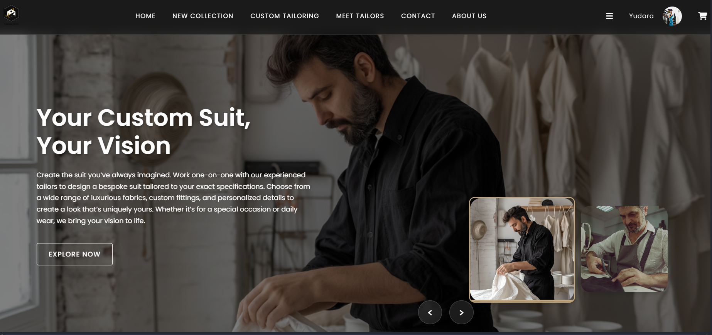
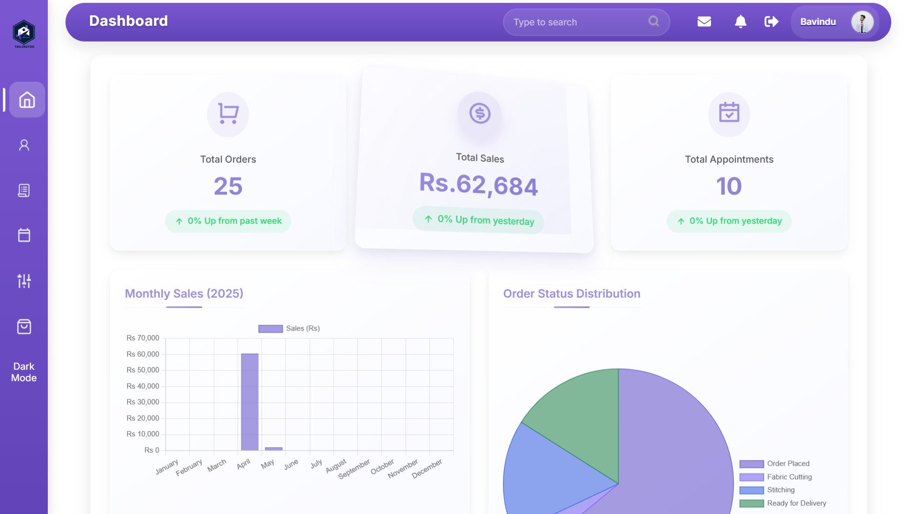
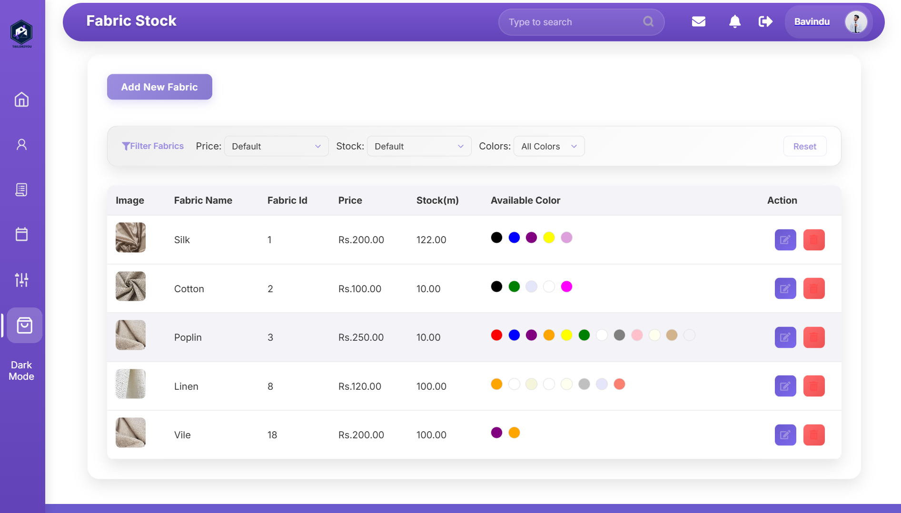
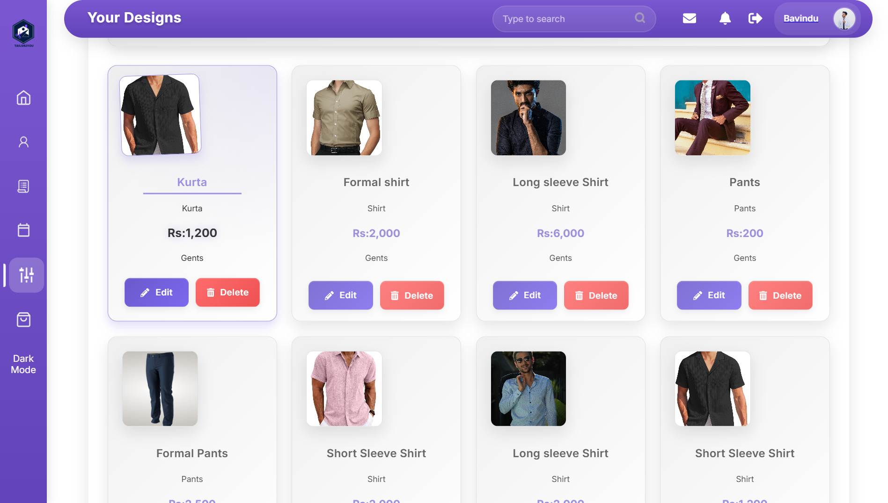
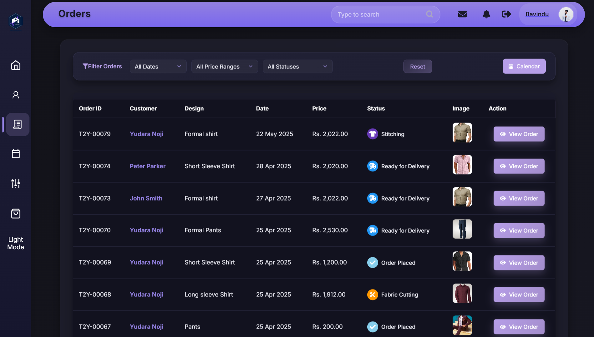
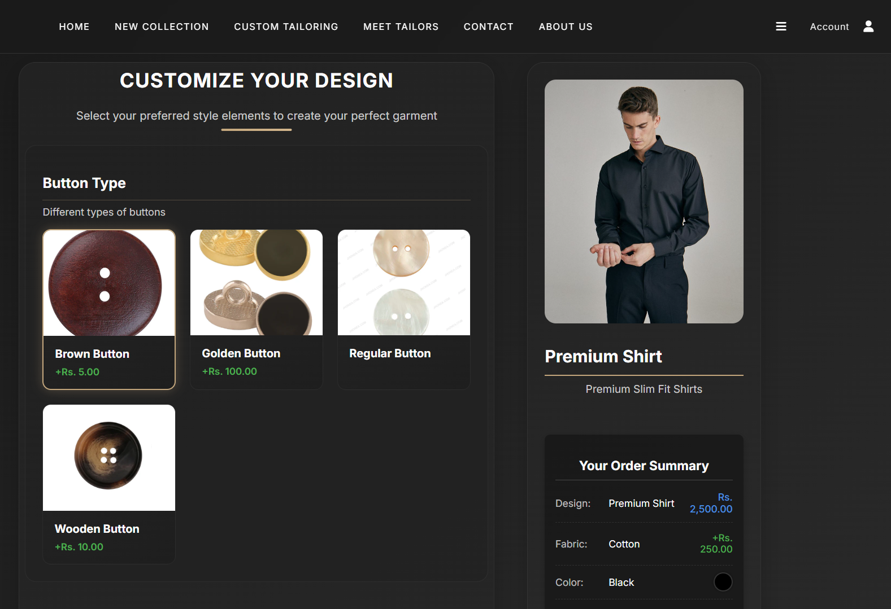

# Tailor2You

<p align="center">
  
</p>

**Tailor2You** connects customers, tailors, and shopkeepers on a single platform. Manage appointments, fabric inventory, custom designs, orders, and feedback with a clean, responsive UI.

---

## 🎥 Demo

<a href="https://youtu.be/3ureZbMAvfk" target="_blank" rel="noopener">
  
</a>

---

## 🌟 Features

### For Customers

- Book appointments with tailors
- Browse designs and customize with fabrics/measurements
- Leave feedback and ratings

### For Tailors

- Manage appointments and orders
- Maintain fabric stock with colors, price-per-meter, images
- Showcase portfolio and chat with customers

### For Shopkeepers

- Fabric stock and pricing management
- Customer interactions and basic reporting

### For Admins

- User management and review moderation
- Sales and activity reports

---

## 🖼️ Screenshots

<p>
  
</p>
<p>
  
</p>
<p>
  
</p>
<p>
  
</p>
<p>
  
</p>
<p>
  
</p>
<p>
  
</p>

---

## 🚀 Installation (XAMPP)

### Prerequisites

- PHP 7.4+ (or newer)
- MySQL
- Composer
- XAMPP/WAMP

### Steps

1. Clone the repository

   ```bash
   git clone https://github.com/Team-High-Five/Tailor2You.git
   ```

2. Import database schema (examples in `dev/`)

   - `dev/Tables.sql` (and other `.sql` files if needed)

3. Configure environment in `app/config/Config.php`

   ```php
   define('DB_HOST', 'your-db-host');
   define('DB_USER', 'your-db-user');
   define('DB_PASS', 'your-db-password');
   define('DB_NAME', 'your-db-name');
   ```

4. Install PHP dependencies (if any)

   ```bash
   composer install
   ```

5. Run
   - Place the project under `htdocs`
   - Start Apache/MySQL in XAMPP
   - Visit: `http://localhost/Tailor2You/public` (or `http://localhost/Tailor2You` depending on your setup)

---

## 📖 Usage

Key pages (examples):

- Home: `http://localhost/Tailor2You/pages/index`
- Tailor dashboard: `http://localhost/Tailor2You/tailors/dashboard`
- Fabric stock: `http://localhost/Tailor2You/fabrics/displayFabricStock`

---

## 🛠️ Tech Stack

- PHP (custom MVC), MySQL
- HTML, CSS, JavaScript
- FPDF (PDF), Composer (deps)

---

## 📂 Project Structure

```plaintext
Tailor2You/
├── app/
│   ├── config/            # App configuration (DB, URLROOT, APPROOT)
│   ├── controllers/       # Controllers
│   ├── models/            # Data models
│   └── views/             # View templates (PHP)
├── public/                # Public assets (CSS, JS, images) + index.php
├── dev/                   # SQL schemas and utilities
├── docs/
│   └── readme-images/     # Images used in this README
└── README.MD
```

---

## 🤝 Contributing

1. Fork the repo
2. Create a branch: `git checkout -b feature/your-feature`
3. Commit: `git commit -m "feat: your change"`
4. Push: `git push origin feature/your-feature`
5. Open a PR

---

## 📧 Contact

- Email: support@tailor2you.com

---

## 📜 License

MIT — see [LICENSE](./LICENSE)
